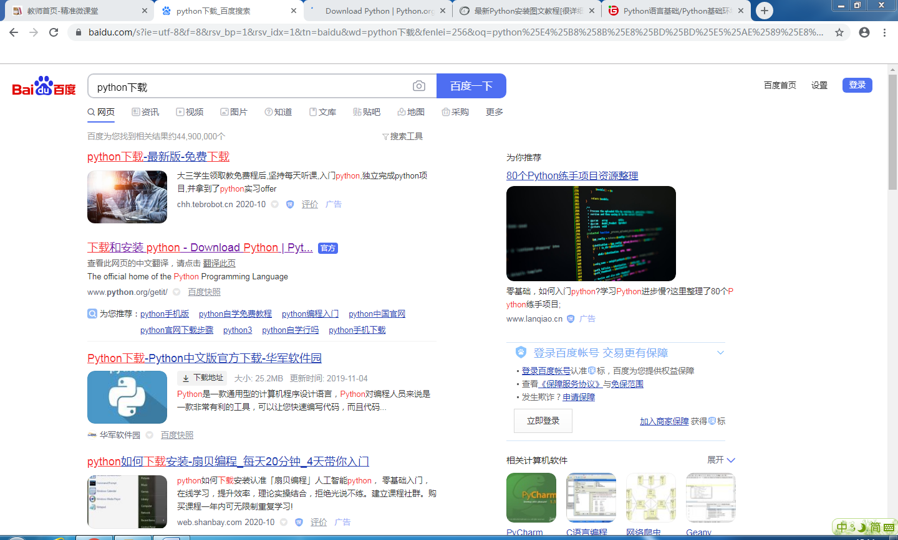
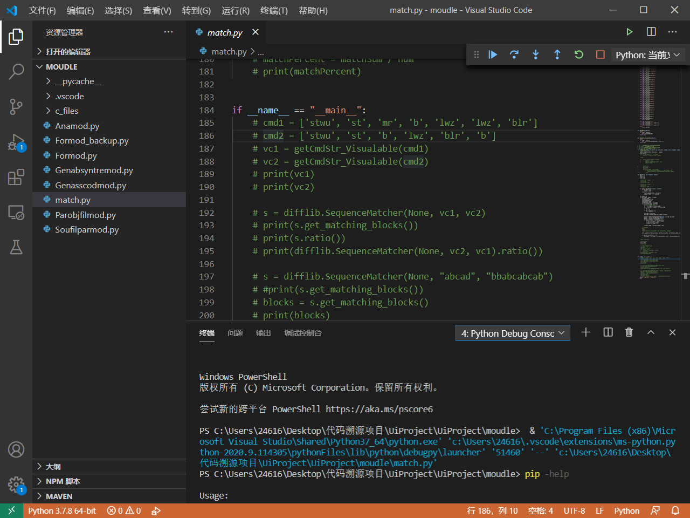

# 安装Python3.7/Python3.8
 

<https://www.python.org/getit/> 

安装好后，配置一下环境变量：
```
path=%path%;C:\python3.7.0
```
其中，C:\python3.7.0是python安装的根目录。

# 安装pip包管理器

包管理器就是管理项目软件包的工具。

** 简单解释一下，为什么要有包管理器？** 包管理器出来之前，开发有两个痛点。

1. 开发人员在做项目开发中，为了避免重复造轮子，都会使用部分别人的代码，这部分代码会打包成库提供给别人使用。但是每个人都有不同的编程习惯，或者编程规范，这样导致大家搞出来的库规范不统一，这样的话，别人要使用库就很麻烦，必须得知道你的库的规范。
2. 往往来说，库与库之间的依赖关系也是盘根错节，A库依赖B库，B库依赖C库，...。开发人员想要使用某个库，就得自己去解决该库的依赖问题。对于复杂一些的库，解决依赖问题是个很头疼的事情。


包管理器就把库的规范给统一了，并且提供了交互工具，来自动添加你需要的库。这样就解放了，繁杂的库的配置，以及依赖的管理。

很多语言都有自己的包管理器，比如Python的pip包管理器，Java的maven包管理，Javascript的npm包管理等。

在windows的python安装包里，一般pip已经内置了，所以不需要单独安装了。


# 安装Python编辑器

不推荐安装IDE，Pycharm是python比较流行的IDE。What's IDE？Integrated Development Environment（集成开发环境），就是把各种工具与环境集成到一起，方便开发人员专注于代码，而不是环境配置。Java的IDE常见的就是eclipse开源软件，目前互联网公司流行的Java IDE是Idea（闭源软件，不过个人非盈利目的使用，可以破解的嘛）。

为什么不推荐使用IDE？很多人说IDE适合新手使用，我不这样认为啊，新手上来直接使用IDE是很不好的习惯，两个原因：

1. 因为这会导致你不了解整个项目工程的运作原理，一旦在IDE中遇到一些工程配置上的问题，你就不知道如何去解决了。尤其是对于Python这种解释性语言，新手上路，不需要IDE，一个好用的编辑器就足够满足需求了。等你学习Python比较熟练了，基础环境配置知道如何搞了，再去使用IDE，会让你的工作效率提升一大截。
2. 一般IDE都有一些智能提示的提高效率的小工具，这对于开发人员来说，比较方便，可以少敲很多代码。但是对于初学者，建议还是不要使用智能提示，直接手敲才是提高编程技能的道理之选。

【tips】什么是解释性语言？什么又是编译型语言？这个涉及到一门课程，叫编译原理，以后有时间单独讲解。简单直观解释一下，解释性语言的特点，是即写即执行，解释器解析代码是一行一行解析执行的；编译型语言不是这样的，编译型语言需要把整个源代码经过编译器翻译成目标代码（机器码010101），然后交给底层操作系统执行代码。举个例子，Python就是解释性语言，通过后面的学习你就可以看到什么叫即写即执行；Java就是编译型语言，需要先经过JVM（java虚拟机）编译为.class字节码，然后交给JVM执行代码。这部分只做简单了解，不是课程重点，我会在课程中穿插着给你讲述一些超纲的知识，扩展你的知识广度。

所以，我们这里使用 vscode 代码编辑器，这个也是目前比较流行的编辑器。简单介绍一下vscode，微软开发的一款开源编辑器，优势是插件化，界面简洁美观。


其实，我常用的编辑器是有着 "编辑器之神" 的 Vim 编辑器。这个后面的课程安排 Linux基础中我会给你介绍这款神一样的编辑器。