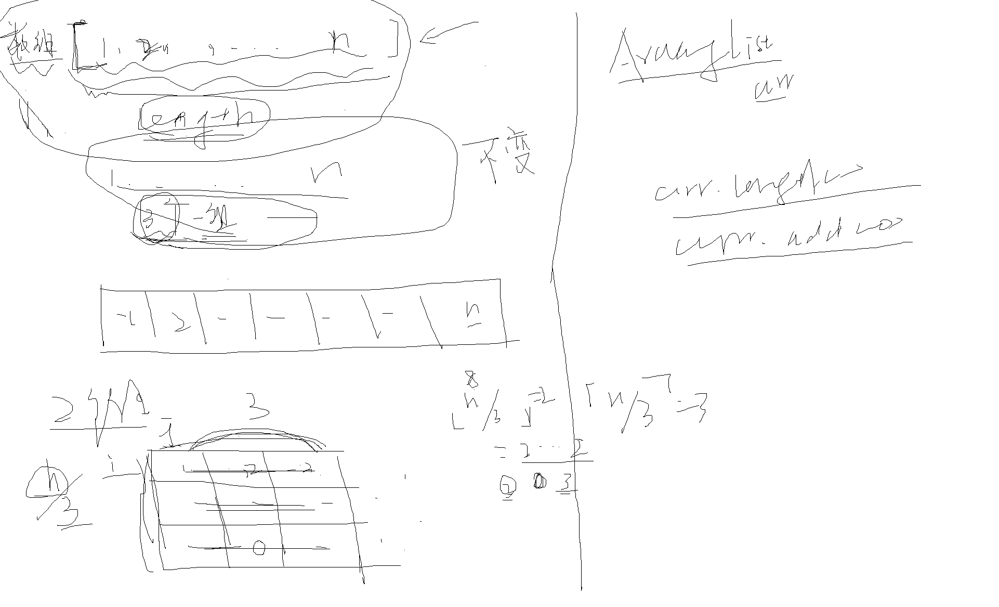

# 第一个Python程序

不管前路多艰难，都是从“hello world”开始的。一行代码：
```
print ("Hello, Python!")
```

python有两种运行的方式，一种是在解释器终端以交互模式执行，一种就是命令行的方式执行。

# Python有哪些变量类型？

python本身是弱类型语言，区别于Java（强类型语言），因此本身来说，python变量类型是很随意的，这也是为什么python不用像java一样，在声明变量时必须强制指定变量的类型。举个例子，在python中定义一个整型变量只需要 `a = 1` ，但是java就必须 `int a = 1;`



<https://www.runoob.com/python/python-variable-types.html>

# Python有哪些运算符？

运算符主要就是起到运算的作用。一般有单目运算符，和双目运算符，有些语言还有三目运算符。python中对运算符的支持是完备的，而且还有所扩展，使得一些常规的运算非常方便。

<https://www.runoob.com/python/python-operators.html>

python中的三目运算符比较独特，不算是运算符了，是一种变体的写法，但是可以等效于C/C++这些语言的三目运算。

 <https://www.cnblogs.com/wanghao123/p/7921654.html>