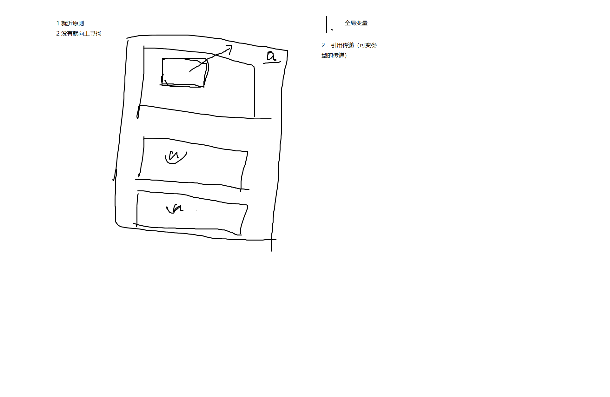

# 课堂笔记




# 函数与调用

函数是所有编程语言都会涉及的一个概念，所以我们先抛开具体的Python的函数语法，来讲讲什么是函数，为什么要有函数。

在数学中，函数就是 y = f(x) , 函数有一个自变量 x ，然后经过一些运算，输出一个函数的值 y。和数学中的函数一样，编程语言中的函数也是需要给一个输入，然后给出一个输出。比如给 x,y两个值，计算x,y的和，可以写为：

```
def F(x,y):
    return x+y;
```
和数学函数不同的是，数学中的函数只是做数值上的运算，编程语言中的函数可以在函数内部封装任何想要的操作。并且，函数的输入输出是非必要的，也即函数可以没有输入或者输出。

那为什么要设计出函数这一概念呢？答案是“封装”。封装顾名思义就是把一段代码提取出来放到一起，这样做的好处有很多。
1. 最大的好处是“复用”。如果一段程序中一个功能经常使用，如果封装起来并提供调用接口就可以直接调用，不用重复书写。
2. 另一个好处就是使得程序逻辑更加清晰。把功能抽离成函数，并写好函数的注释，这样别人读你的代码会很清晰。
3. 还有一个好处，也和复用类似，函数的出现使得把复杂功能封装成库成为可能。大家不用重复造轮子了。


<https://www.runoob.com/python/python-functions.html>

【tips】传递不可变类型与传递可变类型类型区别是什么？


【tips】函数式编程语言和其他非函数式编程语言中函数的概念有何区别呢？

这是一个比较难的概念，需要对函数式编程范式有所了解，这里简单提一下。我之前说过，基本上所有的具有程序设计能力的编程语言（类似html/css这种特殊语言除外）几乎都有函数的概念。那函数式语言显然不是具有函数概念的语言~。

区别函数式语言和其他语言的一个标志就是看其是否支持高阶函数。在函数式编程语言中，函数是作为值存在的，因此所有值可以表达或传递的方式，函数也可以，比如 把函数赋值给一个变量，把函数作为另一个函数的参数，以及把函数作为另一个函数的返回值等，仅仅是这样一个变化，就催生了很多函数式编程的技巧，往往都绕不开高阶函数的使用技巧。高阶函数就是在一个函数中返回函数。而在非函数式编程语言中，函数仅仅是一个静态的程序结构，就是用来封装实现的一个规范。举个简单例子，java中在方法中是不能返回另一方法的，但是在python中可以在函数中返回函数，这就是不同的地方。

# 递归技术


递归属于函数概念中的一个高级概念，意即函数自己调用自己形成递归。往往递归技术用于具有迭代定义的场景。典型的运用递归技术的场景，比如求解斐波那契数列。
```
# 斐波那契数列
# f(0) = 0 , f(1) = 1 , f(2) = f(0) + f(1) = 1 , f(3) = f(1) + f(2) = 2 , .... , f(n) = f(n-2) + f(n-1) 
# 求解 f(n) ?
```

其实这个题可以用`for/while`循环来写，也不难，因为循环本身就有迭代的含义。但是思考一个问题，是不是所有的迭代问题，都可以用for循环去写呢？看下面这个稍微难一点的例子。
```
# 排列组合问题
# 比如n个字母，a b c d ... 
# 请输出这n个字母的所有排列可能。
```

所有`for/while`循环可以做到的，递归都可以；反过来不成立。

【tips】为什么递归能力比`for/while`循环能力更强呢？
因为，递归不需要知道迭代的层数到底是多少，只需要告诉它停机条件就可以了。