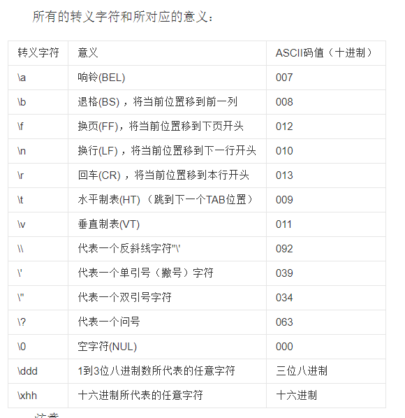

# Number类型

<https://www.runoob.com/python/python-numbers.html>

【tips】python中如何进行进制的转换？
<http://www.360doc.com/content/14/0428/11/16044571_372866590.shtml>

# String类型

<https://www.runoob.com/python/python-strings.html>

【tips】转义字符表

【tips】Python 字符串格式化

<https://www.runoob.com/python/att-string-format.html>

# List类型

<https://www.runoob.com/python/python-lists.html>

# Tuple类型

<https://www.runoob.com/python/python-tuples.html>

# Dict类型

<https://www.runoob.com/python/python-dictionary.html>