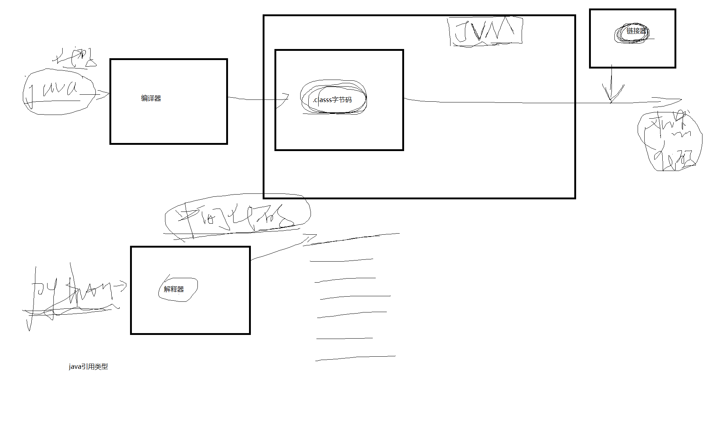

 **课堂笔记**
 

# 什么是编程语言？

编程其实就像是交流，类似与用英语和外国人交流。这里编程语言就类似与英语，同样是一门交流的语言，不同的是英语是和人打交道，而编程语言则是和机器进行交流。我们运用编程语言给机器一个输入，机器在给我们一个输出，这便完成了一次交流。我们要学的就是如何使用编程语言和机器交流，使得机器能够按照你的意思去完成相应的计算任务。

# 编程语言经历那些时期？

编程语言经历了3个界限分明的时代。
	
- 机器语言时代。例如 ，`c7 06 0000 0002` (16进制 )表示在IBM PC上使用Intel 8x86处理器将数字2存入地址为0000的位置。这个时代的语言无需翻译即可被机器直接识别并执行。
- 汇编语言时代。例如，`mov  AX,20H`表示将8位数据20H传送到AX寄存器。这个时代的语言相比机器语言更高级一些，写程序就是运用汇编指令来操作数据与地址进行互动。
- 高级语言时代。前两个时代的机器语言和汇编语言有很多缺点，例如，编写、阅读和理解比较困难；而且严格依赖于特定的机器，代码移植性比较差，为一台计算机编写的代码在应用于另一台计算机时必须完全重写。为了解决这些问题，第三代编程语言，也即高级语言，用类似于数学定义或自然语言的简洁形式来编写程序，极大提高了可读性和可移植性。例如，`let x=2;`表示将2这个值赋值给x这个变量，后续就可以继续使用以2为值的x变量做运算。

类似Python,java,C/C++这些语言都是高级编程语言，对于人类来说，很容易阅读和理解。

# 高级编程语言有哪些分类？

分类的方法不同，分出来的类别就不一样。

- 按是否需要编译，分为 解释性语言（python/shell/javascript/php） 和 编译型语言(java/c/c++)。
    
- 按编程范式不同，分为 面向过程语言（几乎所有编程语言都支持），面向对象语言（java/python/c++/javascript),函数式语言（python/javascript)
- 按数据类型的定义不同，分为 弱类型语言（python/JavaScript/php),强类型语言（c/c++/java）

编程语言本身并无好坏之分，只有领域之分

- 比如c/c++以高性能著称，常用于对于效率要求较高的领域，又因c/c++对于底层指针的访问能力最强，因此在底层开发领域也是c/c++的主阵地。
- python以“胶水语言”著称，可以粘合很多语言，下面有张图可以看到python的粘合能力。除此之外，python因为简单而强大的语法支持，在数据科学、人工智能等领域也是拔得头筹。

- 再比如，JavaScript/node 语言常用于互联网产品中的前端开发领域，比如写网页建网站，写APP，JavaScript/node是佼佼者。
- java语言因为其强大的面向对象建模能力，多用于互联网产品后端开发，服务端开发等领域。除此之外，java作为最资深的跨平台语言，在云计算，云平台领域也是支柱语言。

# 一门高级编程语言都有那些要学习的东西？

总结来说，不管是什么类型的编程语言，虽然在底层解析上/领域上有些不同，但是基本上在表达方式（也就是如何编写代码）基本上大同小异。

- 数据类型
- 流程控制
- 函数与调用
- 模块
- I/O（输入输出）
- 异常处理

以上是面向过程语言会有的共性的概念，对于支持面向对象的语言，可能还存在以下内容：

- 面向对象思想
- 类与对象
- 类的封装性
- 类的继承性
- 类的多态性
- 覆写与重写
- 接口/抽象类
...

后面对于python的讲解也是按照这样的顺序进行的。
