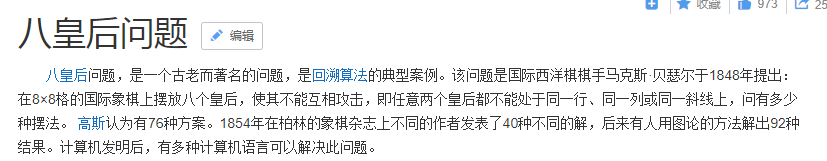

1. 题目：一球从100米高度自由落下，每次落地后反跳回原高度的一半；再落下，求它在第10次落地时，共经过多少米？第10次反弹多高？

2. 题目：一个5位数，判断它是不是回文数。即12321是回文数，个位与万位相同，十位与千位相同。
3. 题目：输入一个数，求其是否为素数。
4. 题目：

5. 题目：

6. 题目：

7. 题目：

8. 题目：

9. 题目：

10. 题目：

11. 题目

12. 题目

13. 题目

14.

15.

16.

17.

18.

19.

20.

21.
数列

22. 
全排列问题：

23. 
选太子

24.
谁说了谎？

25.
三阶幻方

### 【tips】: 回溯算法的套路总结

26. 
穷举n位二进制数

27. 
一个经典的算法问题： 8皇后问题

28.
本次的挑战题目1： 走迷宫

29.
本次的挑战题目2： 生成循环赛日程表

【经典的分治问题】：
1. 二分搜索问题
在一个排好序的数字列表中，查找一个特定的数字
2. 归并排序问题
[什么是归并排序](https://www.cnblogs.com/chengxiao/p/6194356.html)
