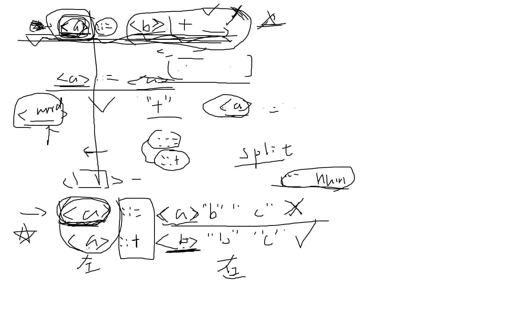

### 1. 正则表达式中都有哪些元字符？分别表示什么含义？回顾一下进行作答

### 2. 正则表达式中的修饰符 g / i / m / s 分别表示什么意思？其中 m 和 g 修饰符有什么区别？

### 3. Python中正则表达式模块re里有哪些常用的方法？这些方法如何使用？回顾一下

### 4. 对于字符串`  abcbcaa`，以下写法的结果是什么？为什么？
- re.match("\w+","  abcbcaa")
- re.search("\w+","  abcbcaa")
- 
```
p = re.compile("\w")
p.findall("  abcbcaa  ")
```

### 5. 实战挑战

下载 EBNF.txt 文本 ， 请结合Python基础中的文件I/O操作和Python正则表达式，完成以下任务

[点击下载](./EBNF.txt)

定义一条文法如下所示 ：
```
<a> ::= ... <b> ... 
或者 
<a> ::+ ... <b> ...
```
::+ 或者 ::= 将文法分为了左部和右部，其中\<a\>表示一个非终结符单词，文法的左部和右部中的非终结符有可能相同，这里就是有可能 `a=b`。
但是如果发生右部中的非终结符与左部非终结符相同，则会导致文法递归产生，这是我们不想要的。
你的任务就是找到这些会导致文法递归产生的文法式，并输出他们的标号。

