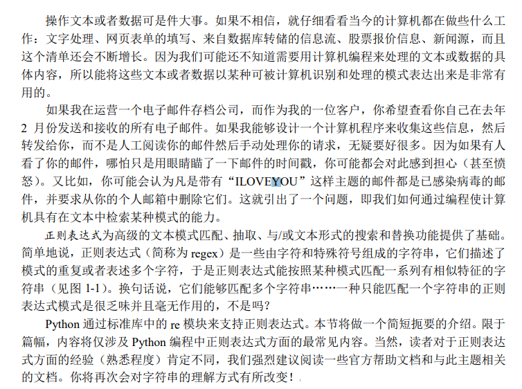

# 简介/动机



# 什么是正则表达式？


你可以简单的理解正则表达式为一种描述构词的形式化方法。举个例子，往往来说，编程语言中的变量名称的命名规范都是这样的：

> 变量命名可以使用字母，数字与下划线的组合，且开头必须为字母

如果让你去用符号语言把这个规则描述一下，你会怎么做？或者说，对于一个字符串输入，让你判断是否符合此规则，你会怎么编程实现？我想你可能要这样编写：
```python
# 假设str是输入字符串
isVar = false
if(str[0] == 'a' || str[0] == 'b' || ....):
    i = 0
    while(i<len(str)):
        if(str[i] == 'a' || str[i] == 'b' || ... || str[i] == '0' || ... || str[i] == '_'):
            isVar = true
 if(isVar):
    print("str是变量")
```

这样写的代码相当繁琐，而且容易出错。使用正则表达式，只需要一行即可解决这个问题。

```python
# 假设str是输入字符串
if re.match(r'^[a-zA-Z][a-zA-Z0-9_]*$',str) is not None:
    print("str是变量")
```
其中，`^[a-zA-Z][a-zA-Z0-9_]*$`就是正则表达式，它完备地用符号语言描述了上面的变量的构词规则。这就是正则表达式的魔力！！！

# 入门正则表达式


<https://www.runoob.com/regexp/regexp-tutorial.html>

# python正则表达式


<https://www.runoob.com/python/python-reg-expressions.html>

# 进阶正则表达式


# 正则表达式速查表

