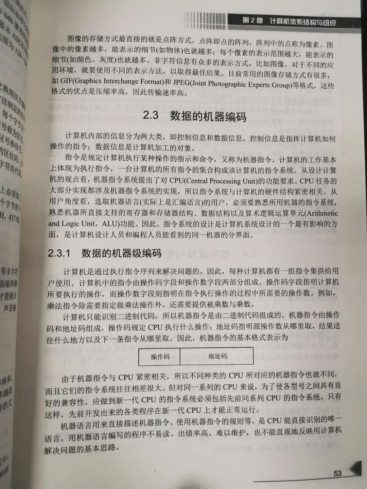
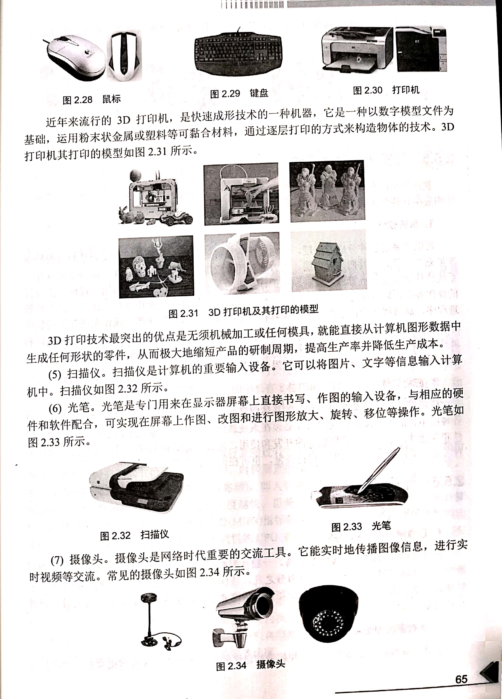

# 1 数值数据

计算机只识别二进制编码的指令和数据，其他如数字、字符、声音、图形、图像等信息都必须转换成二进制的形式，计算机才能识别。之所以使用二进制，是因为二进制只有两个状态（0或1），这正好与物理器件的两个状态相对应，如电压信号的高和低、门电路的导通和断开等。如果使用我们常见的10进制来描述的话，电路需要10个状态，这对于电路开发集成来说十分复杂。因此采用二进制将使计算机在物理实现上变得简单，且具有可靠性高、处理简单、抗干扰能力强等优点。

### 1.1 数的表示及数制转换

最常见的是十进制数，我们从小到大学习的数学都是使用十进制数进行构建的，这是因为十进制比较适合人类理解。其他常见的进制，还有 二进制、八进制、十二进制以及十六进制。

那么数制一般如何表示呢？数制表示方法很多，常见的有以下几种。

1. 下标法
   下标法是指用小括号将所表示的数括起来，然后在括号外的右下角写上数制。(1001.01)2、(751)8、(560)10、(63AC)16等
2. 字母法
   字母法是指在所表示的数的末尾写上相应数制字母。对应的进制与字母如表：

|进制|十进制|二进制|八进制|十六进制|
|---|----|----|----|----|
|所用字母|D|B|Q|H|

    例如 1001.01B、751Q、560D或560、63ACH等
3. 数制间的基本关系

|十进制|二进制|八进制|十六进制|
|---|---|---|---|
|0|0000|00|0|
|1|0001|01|1|
|2|0010|02|2|
|3|0011|03|3|
|4|0100|04|4|
|5|0101|05|5|
|6|0110|06|6|
|7|0111|07|7|
|8|1000|10|8|
|9|1001|11|9|
|10|1010|12|A|
|11|1011|13|B|
|12|1100|14|C|
|13|1101|15|D|
|14|1110|16|E|
|15|1111|17|F|

4. 数制之间的转换
    - 二进制与十进制的转换 <https://zhuanlan.zhihu.com/p/75291280?utm_source=wechat_session> | <https://jingyan.baidu.com/article/597a0643614568312b5243c0.html>
    - 二进制与八进制的转换
    - 二进制与十六进制的转换

### 1.2 数的原码、反码和补码 (以 10D/9D 和 1010B/1001B为例)

【tips】为什么二进制的负数范围要比正数范围多一个单位，比如8为二进制数的有符号数范围为 -128 ~ 127 ?
<https://blog.csdn.net/LingXi__Y/article/details/79569668?utm_source=blogxgwz0>

【tips】左移右移运算？
初级篇<https://blog.csdn.net/weixin_42837024/article/details/98734787>
高级篇<https://www.cnblogs.com/fightfor/p/3871624.html>

总结一下，左移右移运算是在底层实现上是直接对位进行操作，所以速度是比10进制运算要快的，因此在某些乘除运算中，位运算就更快一些。不过这个因为需要考虑溢出的情况，而且对于有符号无符号的时候情况各不相同，比较复杂，所以平时写代码其实很少用到，除非是对性能要求较高的时候才使用。

### 1.3 定点数与浮点数

【tips】定点数运算不会出现误差，因此在对数值精度较高的场景（如电子货币应用，支付宝/微信支付，银行业务）是使用定点数来存储数据；浮点数运算精度会有所损失，但是因为浮点数可以表示的数范围很大，因此常用于科学计算，数据处理等场景。

【tips】为什么 0.1 + 0.2 ≠ 0.3 ？
浮点数精度的缺失导致的 <https://segmentfault.com/a/1190000012175422>

# 2 非数值数据

在计算机中，除了可以对数值数据进行处理以外，还能处理非数值的数据，非数值的数据有字符、声音、图形、图像等数据信息。由于计算机只处理二进制编码形式的数据，因此非数值数据都必须转换为二进制表示的形式才能提供给计算机进行处理。

【tips】ASCII码是比较老的字符编码，编码范围127个，只能表示很有限的字符集。扩展的ASCII码表示范围为256个。目前常用的是国际Unicode码，支持多国语言字符编码。国内还有一个常见的就是GBK编码，大部分项目中遇到的字符乱码问题都是GBK与utfx编码不匹配。

# 3 数据的机器编码

# 4 计算机系统的组成

### 图灵模型（也叫“图灵机”）

图灵的基本思想是用机器来模拟人们用纸笔进行数学运算的过程，他把这样的过程看作是下列两种简单动作：
- 在纸上写上或擦除某个符号
- 把注意力从纸的一个位置移动到另一个位置

而在每个阶段，人要决定下一步的动作，依赖于此人当前所关注的纸上某个位置的符号和此人当前思维的状态。
这个机器的每一个部分都是有限的，但是它有一个潜在的无限长的纸带。当然，这种机器只是一个假象的设备。图灵认为这样的一台机器就能模拟人累所能进行的任何计算过程。

【tips】图灵生活的那个时代还是没有计算机的时代，但是那时候图灵已经从理论上证明了计算机存在的可能性。[什么是图灵机？](https://zhuanlan.zhihu.com/p/125645744)

### 冯·诺依曼模型

虽然图灵机的思想在当时已经非常先进，但是图灵机只是一种构想，图灵并没有清楚的给出计算机到底应该有哪些部分组成，每个部分又是扮演什么样的角色？另一位天才回答了这个问题——他就是冯·诺依曼。他提出的计算机模型一直沿用至今日，我们目前使用的计算机的逻辑模型就是冯·诺伊曼模型机。

### 计算机系统的组成

### 计算机硬件系统

【tips】笔记本的主板长啥样子？揭开后盖看看

【tips】[南北桥是什么？](http://www.elecfans.com/baike/zhujipeijian/zhuban/20180514676973.html)

### 计算机软件系统

软件是指在计算机上运行的各种程序，及各种相关的文档。通常将软件分为系统软件和应用软件。

- 系统软件。一般把靠近底层，为方便使用和管理计算机资源的软件称为系统软件。系统软件通常是负责管理、控制和维护计算机的各种软硬件资源，并为用户提供一个友好的操作界面，以及服务于一般目的的上机环境。系统软件包括操作系统（win10，MacOS）、计算机的监控管理程序（鲁大师、软硬件检测工具）、高级程序语言的编译器或解释器（GCC/G++ , JVM等）以及系统服务程序（比如数据库管理系统）等。
- 应用软件。应用软件是针对某个应用领域的具体问题而开发和研制的程序，它是由专业人员针对各个应用目的而开发的。应用软件必须在系统软件的支持下才能工作，它具有很强的实用性和专业性。

其实，软件发展到现在已经是相当复杂的一个学科，生活中使用的软件的构造和开发流程也是相当复杂的过程。为了对软件更好进行维护和降低复杂度，在系统软件与应用软件之间还有一层软件叫“中间件”。中间件不像系统软件那样提供靠近底层的操作管理硬件的能力，也不像应用软件那样直接给用户提供可视化的操作接口，而是介于两者之间，屏蔽系统软件的复杂性，给应用层软件提供更为统一和简单的接口或者服务。
### 计算机主要的技术指标

# 5 存储系统的结构

### 存储器的分类

### 存储系统的组织结构

# 6 输入/输出系统

