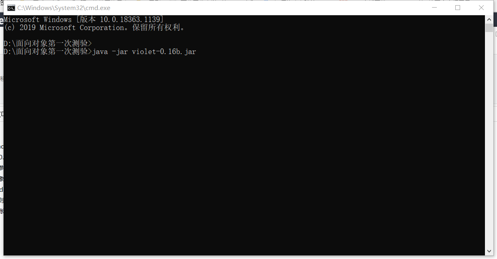
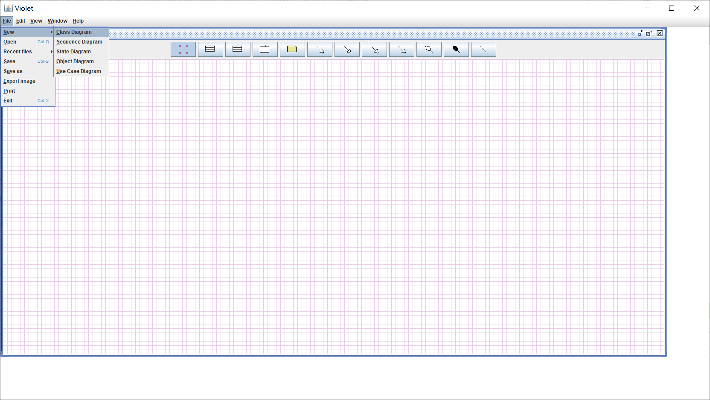
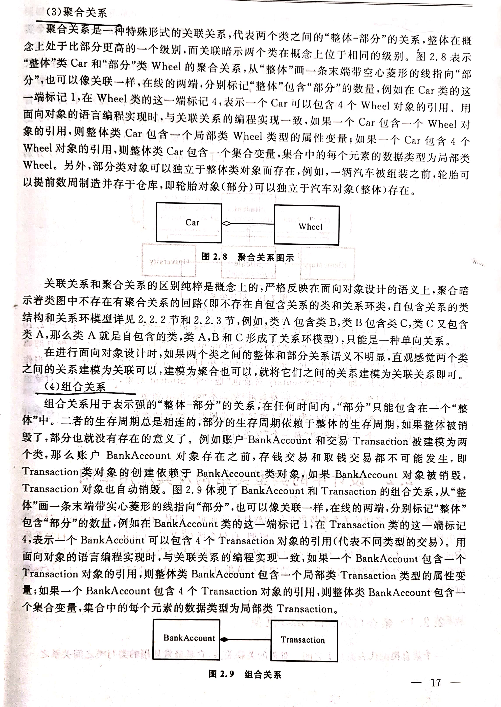
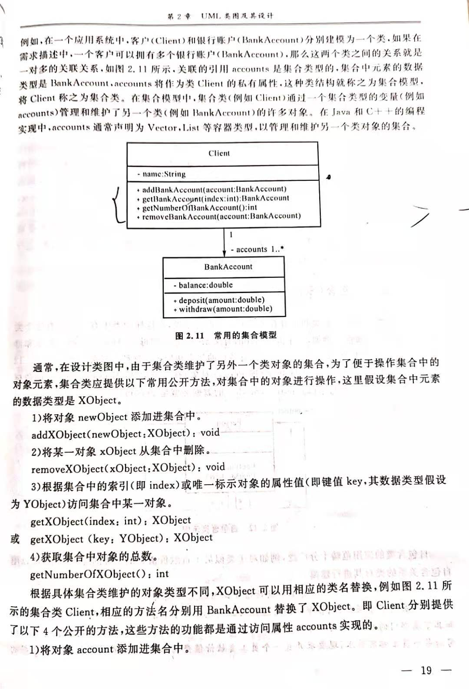
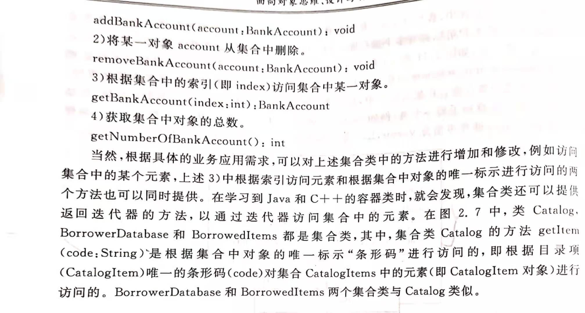
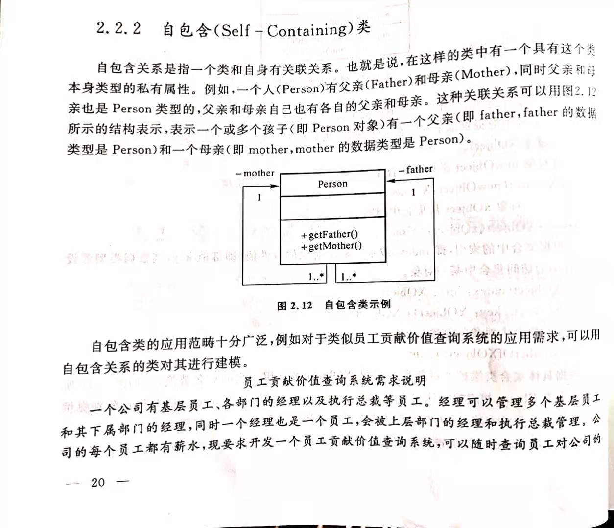
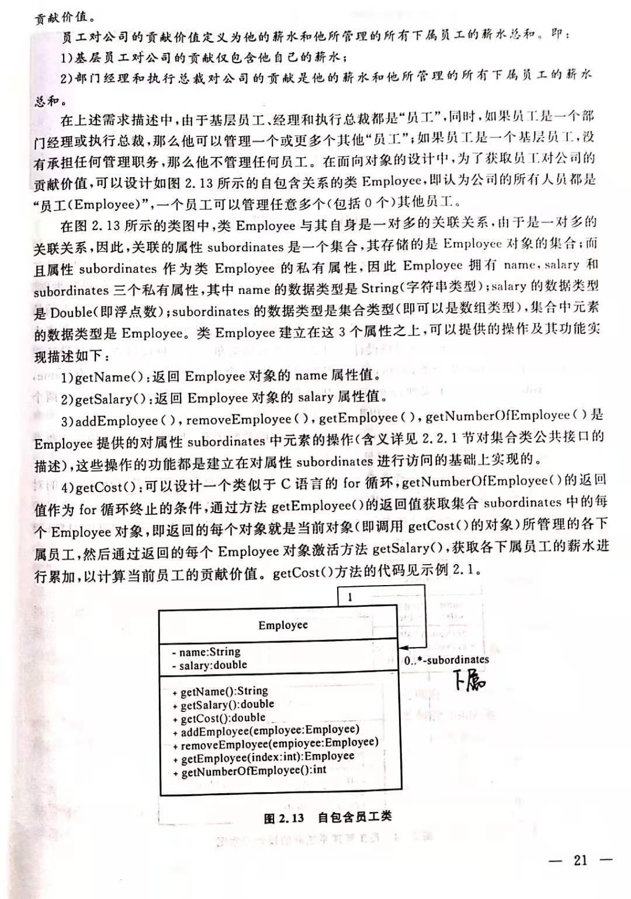
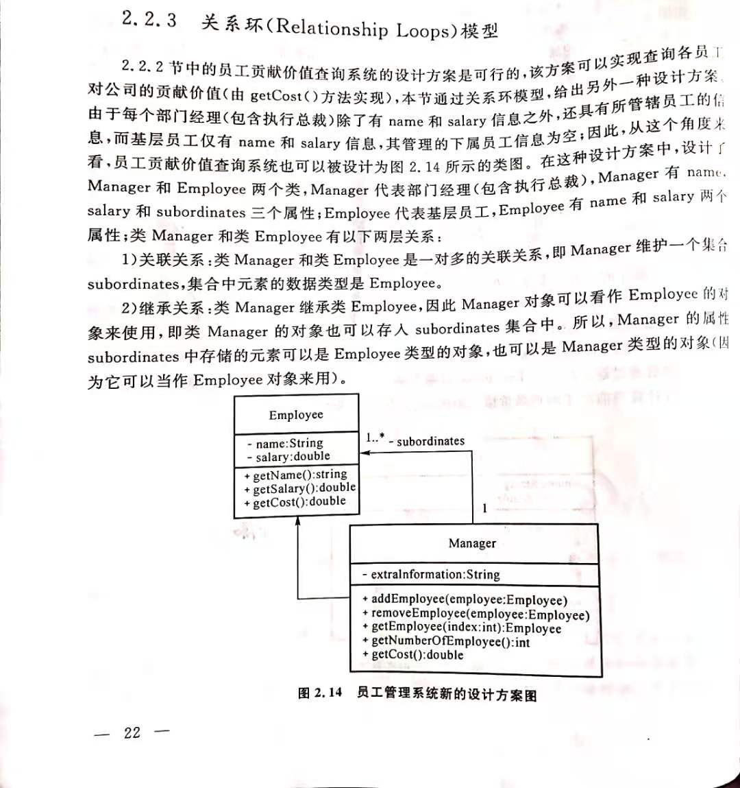
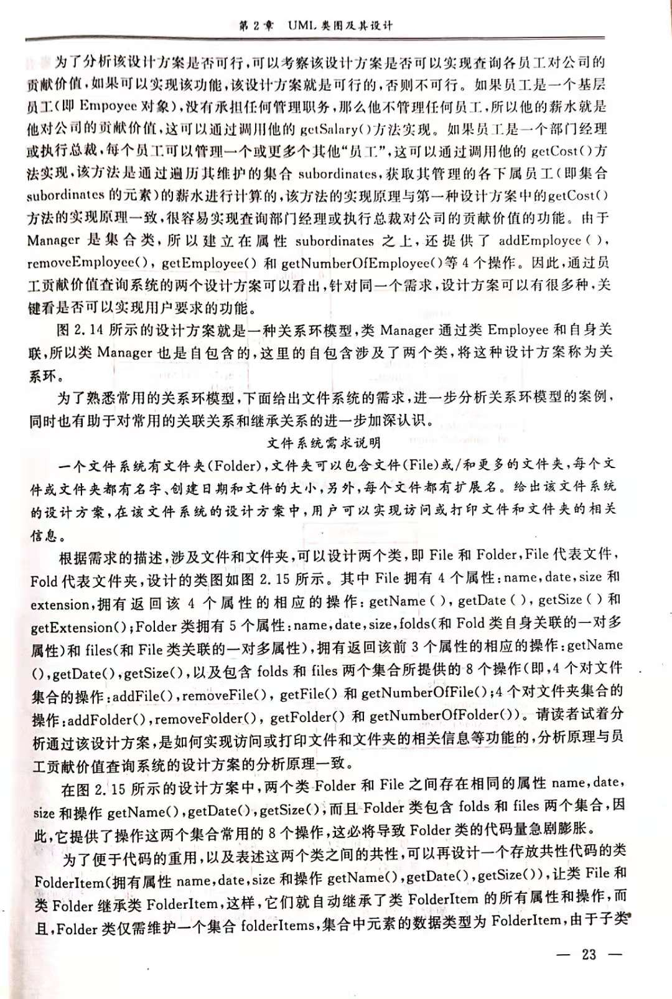
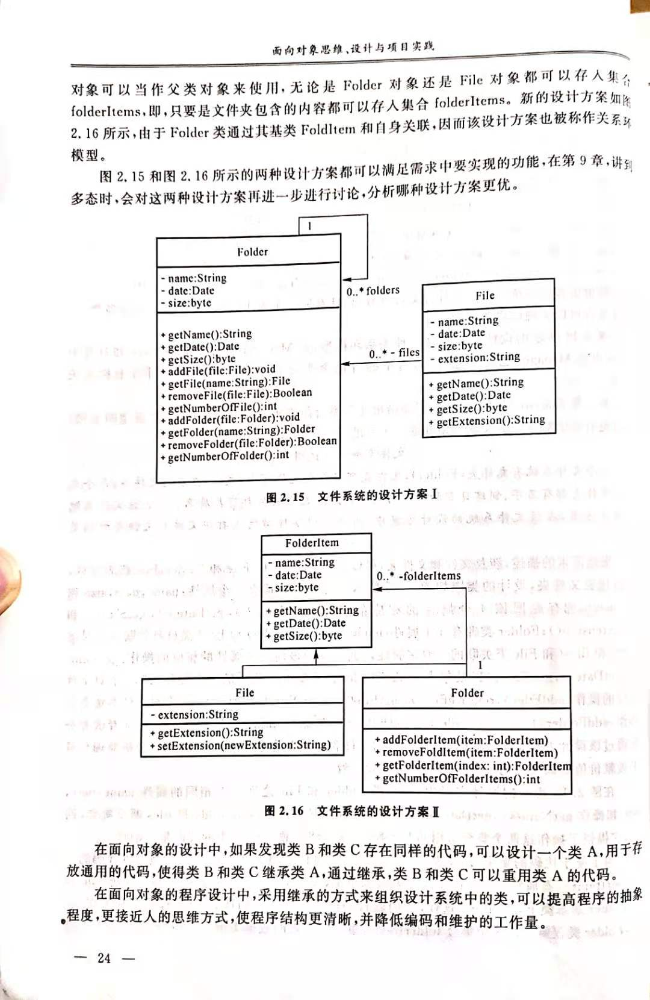

# UML（统一建模语言，Unified Modeling Language）

面向对象是一种思维方式，需要用一种语言表达和交流。就像面向过程编程时，我们可以画程序流程图来和别人交流程序，面向对象编程也有类似的建模语言，毕竟拿模型去和别人交流要比对着代码好理解且清晰的多。UML是面向对象开发系统的产品进行说明、可视化和编制文档的手段，它是软件界第一个统一的标准建模语言。要在团队中开展面向对象软件的设计与开发，掌握UML进行可视化建模是必不可少的。

UML提供了不同视图或者说模型模板来描述系统的静态结构和动态行为。UML类图只是UML建模语言体系中的一个最为常用的一个模板。类图主要用在面向对象软件开发的分析和设计阶段，用来描述系统的静态设计视图。类图也是构建其他动态设计视图的基础。我们这里仅对类图作更深入的讲述。

UML建模语言体系中还包括，

# violet UML建模工具

下载violet工具，是一个jar包，只要电脑上有java运行时环境（jre）即可运行。

[点击下载](./资料/violet-0.16b.jar)

运行violet，有两种方式：

- 直接双击打开，因为是jar包，java运行时会自动打开它
- 双击有时候不行，可能是注册表的问题，可以使用下面的命令打开
    

violet界面比较简陋，但是功能很全：

file->new->class diagram 新建一个类图

# UML类图

类图主要描述系统的静态结构，构建了系统的所有实体、实体内部结构以及实体与实体之间的关系。类图是构建其他设计模型的基础，没有类图，就没有系统各个类之间的结构和关系，就无法用其他UML动态模型图来构建系统的动态行为。下面我们来看看，UML类图是如何描述一个系统的类，类的结构以及类之间关系的。

关于类的结构建模，相对比较简单，一个类主要定义三个内容：

- 类名
- 类属性
- 类方法

除了类结构的定义，UML类图中还有 包和接口 的支持，很简单。

补充一下，关于聚合关系与组合关系：

# 典型类结构及其应用案例

通常，类与类之间的关系要依据具体的软件需求而定。但是，有一些类结构再面向对象设计中经常被用到，例如，集合(Collections)模型，自包含类(Self-Containing)和关系环(Relationship Loops)模型，这些典型的类结构被认为是基本的构建块，用以构建更复杂的应用系统。

### 集合(Collections)模型

一个集合模型代表类与类之间的一对多的关联关系，它是最常用的类与类之间关系之一。

### 自包含类(Self-Containing)

### 关系环(Relationship Loops)模型

