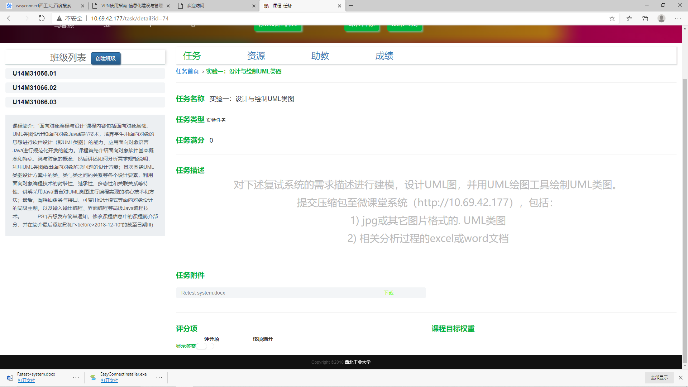

# 建立UML模型的实验练习

遵循以下实验要求，完成相关内容！

下载 👇 具体需求

[Retest-System Model description](../实验一/Retestsystem.docx)

【tips】: 面向对象课程，在西工大软件学院是属于本科二年级的课程哦！这是我带的本科面向对象课程助教时，当时学生的实验课上的实验内容。只需要完成对应的练习任务即可，不需要上传到服务器，那是校内网，你也登录不进去。