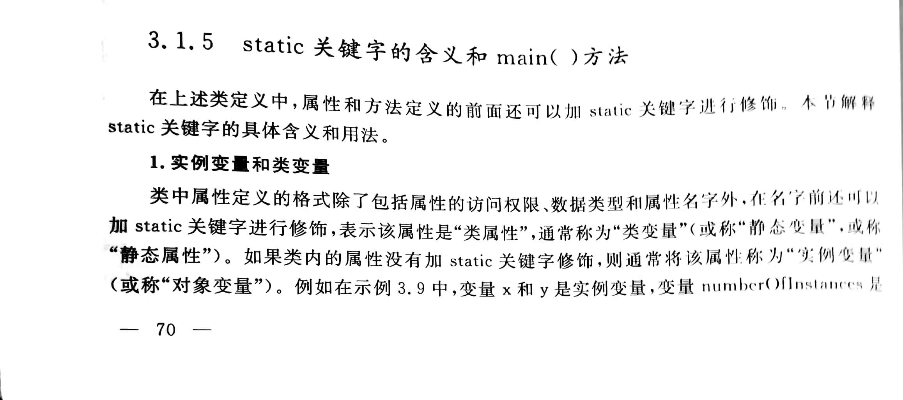
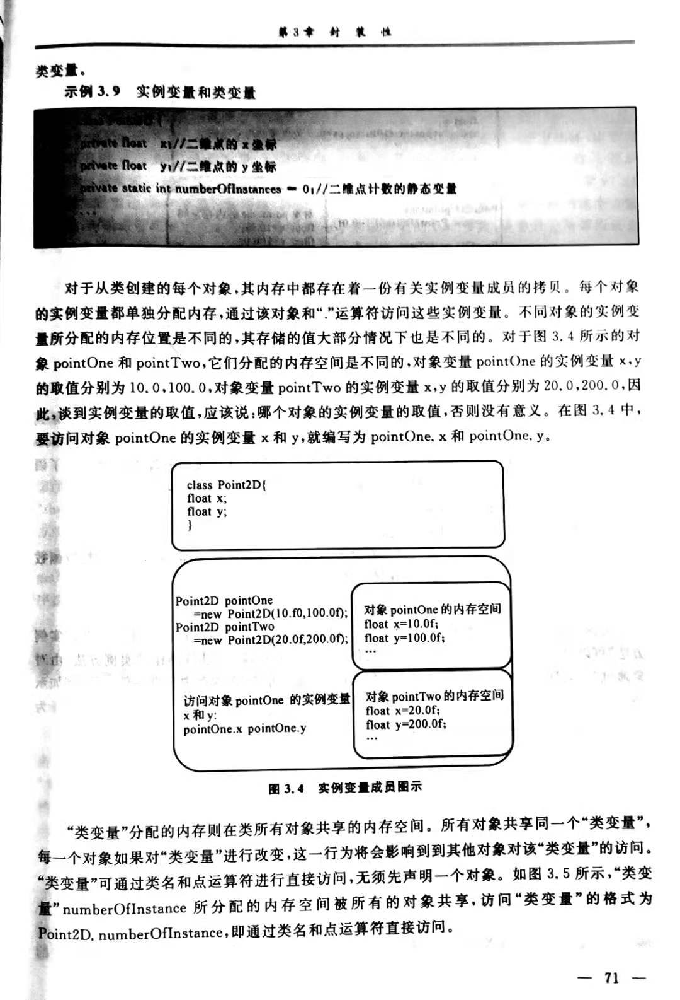
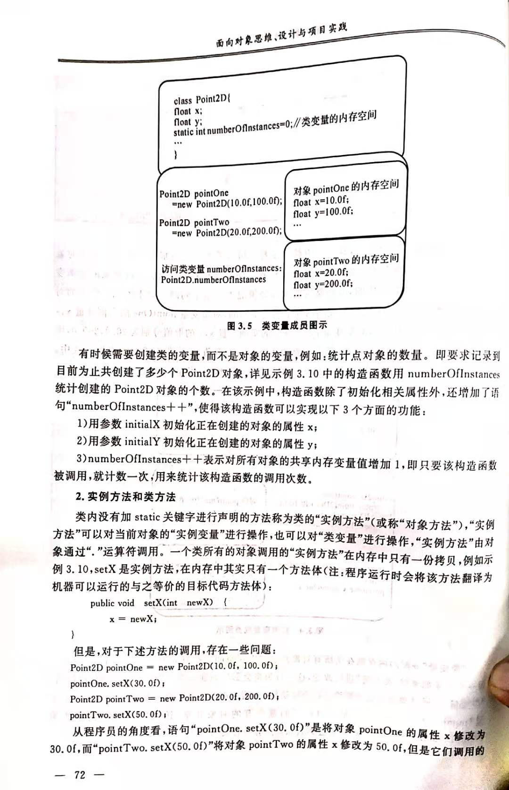
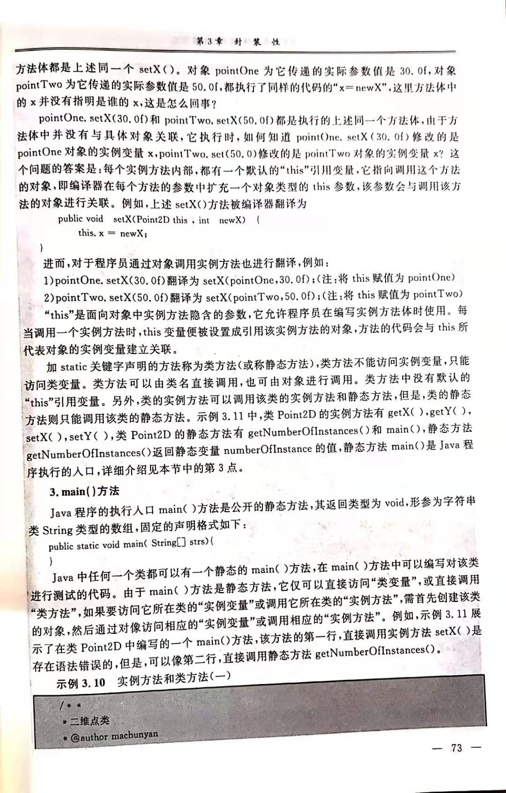
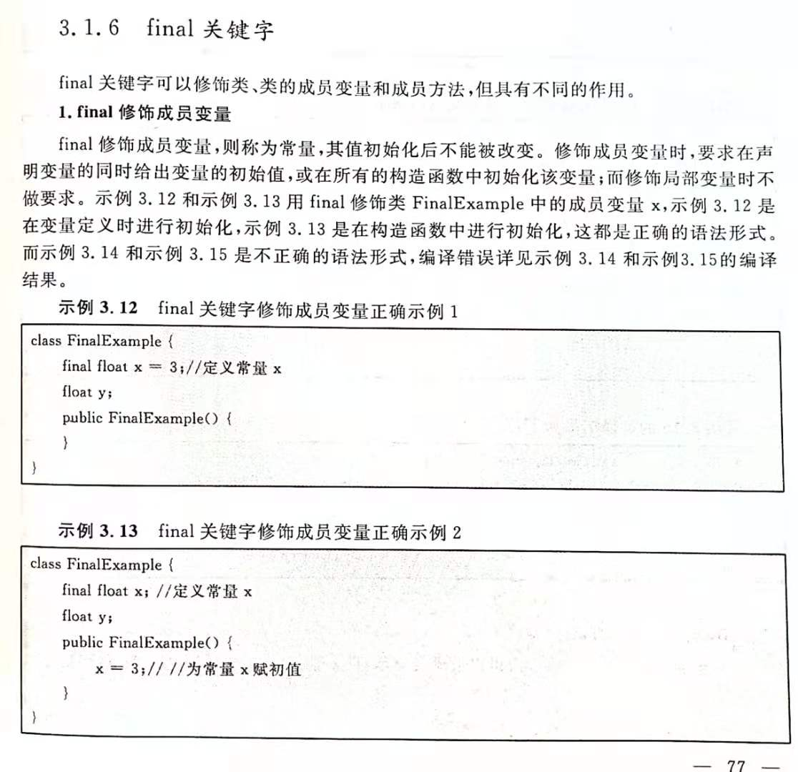
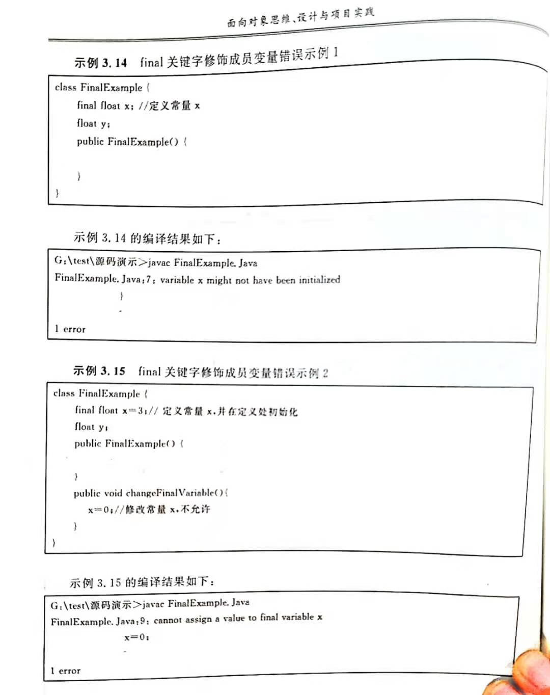

# 类与对象
### 类的定义
- 属性定义
- 方法定义
- 构造方法定义
Java类都有构造方法，用来对类的私有属性进行初始化，如果没有定义构造方法，Java编译器会提供一个缺省不带参数的构造方法 ，缺省构造方法用默认值初始化对象的成员变量，数值型变量缺省值为0，boolean型变量缺省值为false，char型变量的缺省值为“\0”，对象类型的变量的缺省值为 null 。如果想创建对私有属性进行初始化的构造函数，就需要编写一个带有参数列表的构造函数。当然其实在构造函数中做任何其他操作也是可以的，但是一般是为了初始化私有属性。

### 对象的创建与使用
- 对象变量的声明
- 对象变量的创建（或说，实例化）
- 对象的使用
- 对象的清除。当一个对象的引用不存在时，该对象成为一个无用的对象。Java的垃圾收集器自动扫描对象的动态内存区，把没有引用的对象作为垃圾收集起来并释放。

### 方法的形式参数和实际参数的传递方式

Java形参与实参的结合方式为值传递，与形式参数的数据类型是基本数据类型还是对象类型无关。但是，对于对象类型来说，值传递传递的是实际内存的地址，因此这种传递方式也被称为引用传递。

### 方法重载

这是一个比较重要的概念。方法重载是指：在同一个类中，可以定义多个方法名相同，但是参数类型或参数个数不相同的方法。注意方法重载的具体含义，重载是针对参数的类型或者个数不同进行区分的，修饰符不同，或者返回值类型不同，并不能称之为重载，而是方法重定义。Java中不允许一个类方法重定义，因此这种写法会报编译错误。

### static 关键字









### final 关键字

- final修饰成员变量





- final修饰成员方法。表示该方法可以被子类继承，但是不被子类覆写，方法覆写和继承性相关，我们放到继承章节再说。
```java
final returnType method(paramsList){}
```
- final修饰类。表示该类不能被继承。
```java
final class final ClassName{}
```

# Java访问权限控制
### 包的概念
- 引入和使用包中的类
- 自定义包

### Java类的访问权限
- public
- 缺省的
### Java类成员的访问权限
- private
- public
- 缺省
- protected