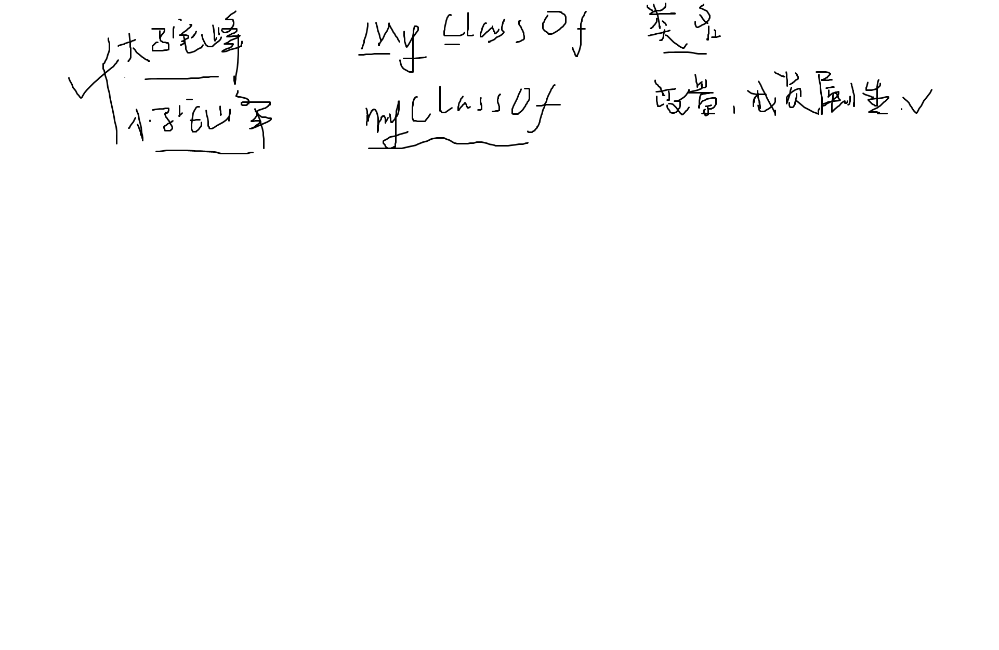

# 面向对象方法论

在学习面向对象开发的概念之前，先来看看现实世界中对象的概念。现实世界中的任何有属性的单个实体或者概念，都可以看作对象。对象可以是有形的，例如：学术“张三”，顾客“李四”，或者教室“403”等。对象也可以式无形的，例如： 一个银行账户、一个客户订单、一门课程等等。

现实中的对象一般都拥有属性，描述了对象的静态特征，例如，学生“张三”拥有属性：姓名、学号、成绩等等；一个银行账户具有属性：用户名、密码、余额等。

除了属性之外，往往需要对对象实体的属性进行操作，实现相应的功能。例如：打印学生“张三”的成绩、查询银行账户的余额等。对对象属性的操作，描述了施加在对象上的动态行为。

再用面向对象技术构建软件或者程序时，其实就是在对现实世界所描述的问题的对象进行建模，把现实世界中的对象抽象为软件中的对象，通过一系列软件对象以及他们之间的互操作，来完成用户要求的功能。

面向对象是一种软件开发方法，包括利用对象进行抽象、封装、通过消息进行通信、对象生命周期、类层次结构和多态技术。对象是核心概念，它是真实世界中实体或概念的软件模型，在面向对象的程序执行过程中，对象被创建，对象之间通过消息进行互操作，以完成相应的功能。

### 1 类与对象

初学面向对象的人往往不能正确掌握类和对象之间的关系。

在现实世界中，划分类别是人类认识事物的基本手段之一，任何实体都可以归属于某类事物，任何对象都是某一类事物的实例。例如，大学生“张三”，大学生“李四”，都可以划分为大学生，此时大学生即为类别，而“张三”“李四”就是此类别中的两个实例。和现实世界类似，划分类别也是面向对象编程中的基本手段。

在面向对象编程中，类就是一个创建对象的空模板（也即属性没有具体的值），它定义了通用于一类事物的所有对象的属性和方法；对象是类的实例，给类中的属性赋予确定的取值，便得到该类的一个对象，所以对象为类模板中的属性提供了具体的值。往往来说，我们把对象和实例看作同义词，对象就是实例，实例就是对象。

从程序设计的角度看，类是面向对象编程中的最基本的程序单元。和Python中的基本数据类型一样，类定义也是一种数据类型，我们称之为对象类型。通过类类型声明的变量称之为对象变量。

在编写面向对象程序时，程序员首先要编写类，以及通过类生成对象的方式，当程序在内存中运行时，对象才被真正的创建并存在，对象以及对象之间的互操作完成功能。某一时刻，一个类可能只有一个对象存在，也可能有多个对象存在。

总结一下：
- 类：是一组对象的描述，这一组对象有共同的属性和行为
- 对象：是一个拥有属性、行为的实体。对象是类的实例，对象的属性和行为在类中定义。

### 2 属性

属性用于保持对象的状态信息，可以简单到只是一个bool变量或者其他基本数据类型。

对于类定义而言，属性用来刻画从该类诞生的所有对象的状态特征。在具体的软件运行时环境中，对象的属性有其确切的取值，属于同一个类的不同对象可能有不同的属性值。

在面向对象的编程语言里，这组从属于某类对象的属性，是用变量来表示的，这些变量称为类的成员变量。

### 3 方法/操作/服务/行为

类内部除了定义属性外，还需要定义一些建立在这些属性上的操作（或者方法），用来实现对象的行为。方法可以用来访问、改变对象的属性，或者用来接收来自其他对象的信息以及向其他对象发送消息，因而这些方法通常作为类的一部分进行定义。

方法是一个对象允许其他对象与之交互的方式，在使用一个类时，更多关注的是它能够提供什么样的方法，如果知道了一个类提供的具体方法，就可以通过该类的对象调用相应的方法完成所需的功能，以满足应用需求。

方法是建立在属性之上的操作的实现，属性有了具体的值，方法调用才有了意义，才能实现功能，所以类中的方法仅仅是定义，方法的调用必须通过对象进行激活，方法才能通过访问属性值来完成一定的功能。

这里的方法与Python中讲的函数非常类似，至少写法上基本一样，不同的地方就在于，方法是封装于类内部的函数，且方法中参数的输入有两个途径：
1. 类的成员属性
2. 外部参数

### 4 消息机制

面向对象中的消息传递其实就是通过方法的调用来激活的，这种消息的传递可能发生在同一个类的不同对象之间，也可能是不同类的对象之间。从面向对象的角度来说，我们会说一个对象向另一个对象传递了消息，但是从程序设计上来说，就是调用方法来实现的。

### 举个例子 

假设，我们需要建立一个 三角形 (Triangle) 的类，应该如何设计这个类呢？

# 面向对象与面向过程编程的比较

面向过程开发方式，仅具有封装性，且封装能力没有面向对象开发方法强。

【tips】究其本质，现代软件架构之所以从面向过程向面向对象过渡，是因为现代软件应用多偏向于对现实世界的抽象建模，比如去商城购物这个生活中的例子，使用面向过程的开发会很麻烦，因为商城购物会涉及很多对象，买家、卖家、商铺、各种各样的商品、购物车、优惠券等等，如果使用面向过程，封装能力有所欠缺，这样就会导致很多变量散落再全局作用域中，导致项目维护的灾难。如果使用面向对象方法，一切就显得顺利成章，对每个事物的抽象封装都可以完全复用，需要用时就使用，不需要时就放到一边即可。

但是，面向过程的方法也有适用的地方，如果一个需求面向的是功能，而不是对现实事物的抽象，那其实使用面向过程会更加自然一些。

【tips】:面向对象开发方法，三大主要特性：

- 封装性。面向对象的封装性很好理解，就是对现实世界的对象的属性/行为等进行封装。
- 继承性。继承性其实就是由具体到抽象，由抽象到具体的过程，其中父类即是子类的抽象，而子类就是父类的具体。
- 多态性。多态是一个比较难理解的概念，很多科班的同学，都不一定能说的清楚这个概念。多态就是在不知道变量具体的类型时还能正确识别此变量的技术。由此可见，弱类型语言是天生就支持多态技术的，所以python的面向对象中多态是件很自然的事情，但是对于java强类型语言来说，多态就显得很神奇了，只需要知道父类的类型，子类的类型是在运行时才获取的。
